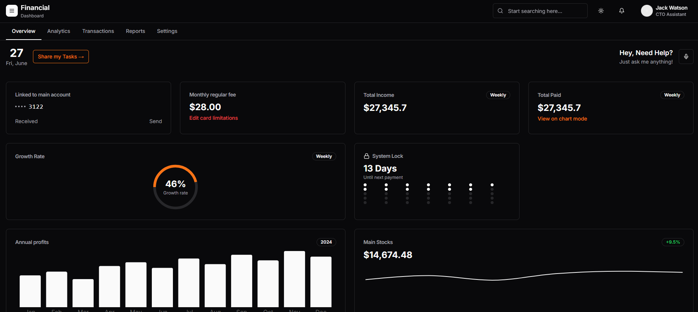

# Financial Dashboard

A modern, responsive financial dashboard built with Next.js 15, React 19, and TypeScript. This application provides comprehensive financial management tools including transaction tracking, analytics, reporting, and wallet verification.
NOTE: The backend implementation is still in progress.



## ✨ Features

- **📊 Dashboard Overview** - Real-time financial metrics and KPIs
- **📈 Analytics** - Interactive charts and data visualization with Recharts
- **💳 Transaction Management** - Track and categorize financial transactions
- **📋 Reports** - Generate and export financial reports
- **🔐 Authentication** - Secure user authentication system
- **⚙️ Settings** - Customizable user preferences and configurations
- **🎨 Modern UI** - Built with shadcn/ui components and Tailwind CSS
- **🌙 Dark Mode** - Theme switching with next-themes
- **📱 Responsive Design** - Mobile-first approach with responsive layouts

## 🛠️ Tech Stack

- **Framework**: Next.js 15 with App Router
- **Language**: TypeScript
- **Styling**: Tailwind CSS
- **UI Components**: shadcn/ui (Radix UI primitives)
- **Charts**: Recharts
- **Forms**: React Hook Form with Zod validation
- **Icons**: Lucide React
- **State Management**: React Hooks
- **Theme**: next-themes

## 🚀 Getting Started

### Prerequisites

- Node.js 18+ 
- npm or yarn package manager

### Installation

1. Clone the repository:
```bash
git clone <repository-url>
cd Financial_dashboard_public
```

2. Install dependencies:
```bash
npm install
# or
yarn install
```

3. Start the development server:
```bash
npm run dev
# or
yarn dev
```

4. Open [http://localhost:3000](http://localhost:3000) in your browser.

## 📁 Project Structure

```
├── app/                    # Next.js App Router
│   ├── api/               # API routes
│   │   ├── analytics/     # Analytics endpoints
│   │   ├── auth/          # Authentication endpoints
│   │   ├── transactions/  # Transaction management
│   │   └── reports/       # Report generation
│   ├── login/             # Login page
│   ├── globals.css        # Global styles
│   ├── layout.tsx         # Root layout
│   └── page.tsx           # Home page
├── components/            # Reusable components
│   ├── ui/               # shadcn/ui components
│   ├── dashboard-layout.tsx
│   ├── overview.tsx
│   ├── analytics.tsx
│   ├── transactions.tsx
│   ├── reports.tsx
│   └── settings.tsx
├── hooks/                # Custom React hooks
├── lib/                  # Utility functions
└── public/              # Static assets
```

## 🔧 Available Scripts

- `npm run dev` - Start development server
- `npm run build` - Build for production
- `npm run start` - Start production server
- `npm run lint` - Run ESLint

## 🎨 UI Components

This project uses [shadcn/ui](https://ui.shadcn.com/) components built on top of Radix UI primitives. Key components include:

- **Navigation**: Sidebar, breadcrumbs, navigation menu
- **Data Display**: Tables, cards, charts, badges
- **Forms**: Input fields, select dropdowns, checkboxes, radio groups
- **Feedback**: Alerts, toasts, progress indicators
- **Overlays**: Dialogs, popovers, tooltips, sheets

## 🔐 Authentication

The application includes a complete authentication system with:
- User login/logout functionality
- Protected routes
- Session management
- Custom authentication hook (`useAuth`)

## 📊 Features Overview

### Dashboard
- Financial metrics overview
- Quick access to key features
- Real-time data updates

### Analytics
- Interactive charts and graphs
- Data visualization with Recharts
- Customizable chart modes

### Transactions
- Transaction history
- Filtering and search capabilities
- Transaction categorization

### Reports
- Generate financial reports
- Export functionality
- Customizable report parameters

### Settings
- User profile management
- Application preferences
- Theme customization

## 🌙 Theme Support

The application supports both light and dark themes using `next-themes`. Users can toggle between themes or use system preference.

## 📱 Responsive Design

Built with a mobile-first approach, the dashboard is fully responsive and works seamlessly across:
- Desktop computers
- Tablets
- Mobile devices

## 🤝 Contributing

1. Fork the repository
2. Create a feature branch (`git checkout -b feature/amazing-feature`)
3. Commit your changes (`git commit -m 'Add amazing feature'`)
4. Push to the branch (`git push origin feature/amazing-feature`)
5. Open a Pull Request

## 📄 License

This project is private and proprietary.

## 🆘 Support

For support and questions, please contact the development team.

---

**Built with ❤️ using Next.js and modern web technologies**